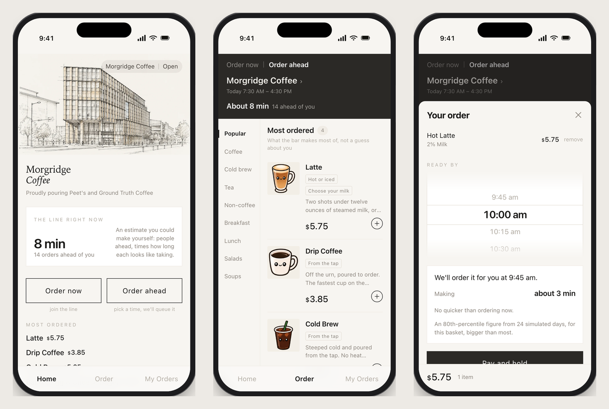
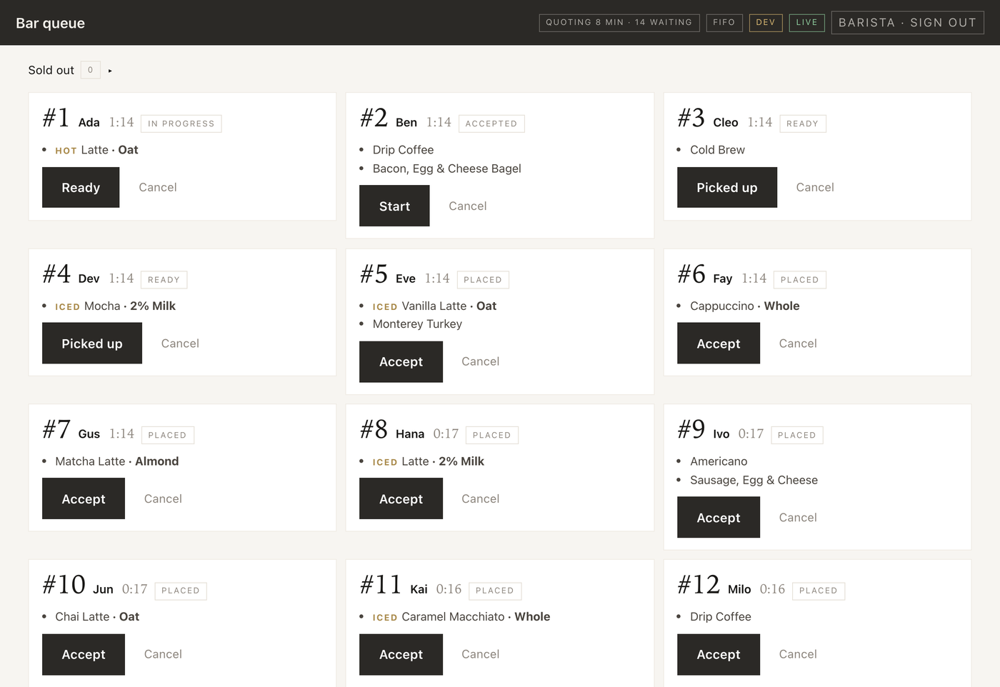
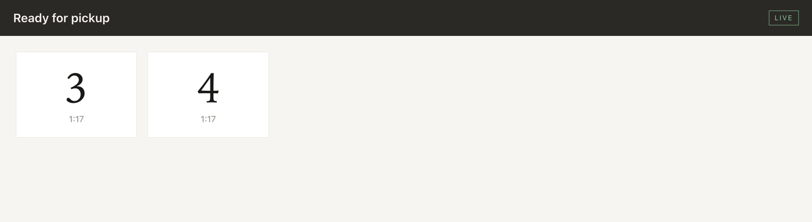
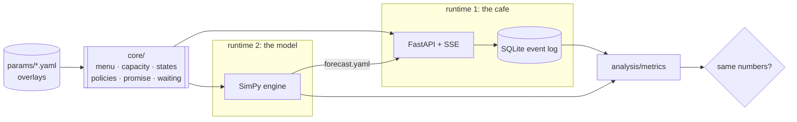

# cafe-flow

[](https://github.com/Jessego5/cafe-flow/actions/workflows/ci.yml)

A discrete-event simulator of a campus cafe and the ordering app it recommends,
built on one shared domain core so the model and the product cannot disagree
about what a latte costs or how long the line is.

It was built to answer one question: *how much additional peak throughput is
available at fixed prices, and which mechanism delivers it*. The answer, after
standing in the cafe with a counter, was **register decoupling, and nothing
else**. Ordering ahead takes the 90th-percentile walk-up wait from
7.0 to 3.0 minutes. Milk batching, queue reordering and demand shifting were
each built, each measured, and each found to do nothing here.

**[Implementation spec and the write-up of what actually happened](campus-cafe-ordering-plan.md)**
· **[What was observed, and how](observations/README.md)**
· **[Deploy runbook](deploy/README.md)**

---

## Demo

The customer app: the line as it stands, the board, and the planner that quotes
*ready by* against *order now*. These are the running app against the running
API, not mockups.



The bar runs on an iPad: one tap per state change, names for the counter, and
the scheduler currently in force named in the header:



And the pickup screen is just the numbers, legible across a room:



The API is the same one the simulator replays into. Every response carries how
much of itself is still guessed:

```bash
$ curl -s localhost:8000/menu | jq '{queue_depth, wait_estimate_s, provenance}'
{
  "queue_depth": 6,
  "wait_estimate_s": 194.9,
  "provenance": "provenance: 67% assumed"
}
```

---

## Quickstart

```bash
python3 -m venv .venv
.venv/bin/python -m pip install -r requirements-dev.txt   # app + simulator + tests
.venv/bin/python -m pytest -q                             # 379 tests, ~50s

cd web && npm install && npm run build && cd ..
.venv/bin/python -m uvicorn app.main:app --reload
```

Open http://localhost:8000. The bar and the sold-out controls need an account,
which is made with a shell rather than a signup form:

```bash
.venv/bin/python -m app.create_staff barista      # prompts for the password
```

| Path | View |
|---|---|
| `/` | customer: the line, the board, the planner, past orders |
| `/bar` | barista: live queue, one tap per transition, what to run together |
| `/pickup` | display: order numbers ready for collection |

The API keeps unprefixed paths (`/menu`, `/orders`, `/orders/{id}`,
`/orders/{id}/transition`, `/plan`, `/held`, `/queue`, `/display`, `/slots`,
`/stream`, `/config`, `/healthz`), with `/login`, `/queue` and
`PATCH /menu/{name}` behind the staff session. Browse them at `/docs`. For
frontend work `cd web && npm run dev` proxies them to uvicorn on :8000.

| Variable | Default | Notes |
|---|---|---|
| `CAFE_ENV` | `dev` | `pilot` refuses simulated orders at the API |
| `CAFE_DB` | `out/cafe.db` | SQLite; Litestream replicates it in production |
| `CAFE_PARAMS` | `params/base.yaml:params/observed.yaml` | colon separated, merged left to right |
| `CAFE_SECRET_KEY` | *(generated)* | unset means every login ends when the process does |
| `CAFE_FORECAST` | `params/forecast.yaml` | what the planner quotes from |

**Requirements:** Python 3.13, Node 22. No GPU, no external services, no API keys.

---

## Architecture



| Layer | Choice | Why |
|---|---|---|
| Domain | plain Python in `core/`, no framework imports | both runtimes import it, so neither can grow its own idea of the rules |
| API | FastAPI + SQLModel + SSE | one process serves the API and the three built views: no CORS, no second origin |
| Store | SQLite, append-only event log | the log is the only source of truth; the order table is a projection of it |
| Simulator | SimPy | discrete-event, seeded, runs a day in about a second |
| Config | YAML overlays with per-field provenance | every number knows whether it was observed, published, fitted or assumed |
| Deploy | Docker + Fly.io + Litestream | one machine, one volume, restore verified in CI |

---

## How it works

Parameters describe a cafe: stations and their capacities, a menu whose items
resolve to station plans, staffing by time of day, and how demand arrives. Both
runtimes read that file and import `core/`. The app turns HTTP into state
transitions and appends events; the simulator runs the same rules against
virtual time and appends the same event shapes. `analysis/metrics.py` reads
either log without knowing which produced it, which is what makes the drift
check below possible.

The simulator writes `params/forecast.yaml`, and the app reads it to answer two
questions in the planner: *when will this be ready if I order now*, and *when
should it be ordered to be ready by 9:45*. The second is a fixed point (the
right moment to order depends on the queue at that moment, which depends on
when you order), solved by walking back from the time wanted.

```
core/       the rules: menu -> station plan, capacity, state machine,
            scheduling policies, promises, the visible wait
app/        FastAPI, SQLite, SSE, the release loop, auth
sim/        SimPy engine, arrivals, balking, experiments, policy selection,
            and client.py, which replays a day at the running app
analysis/   metrics, calibration against counted observations, demand from a
            till export, figures
params/     base.yaml (assumed + published) and overlays that correct it:
            observed.yaml, the weekday schedules, the monthly hot/iced splits
observations/  what was counted, in the counter's own notation
web/        the three views, built by Vite
```

---

## Results

### The question, answered

| mechanism | built | effect at this cafe |
|---|---|---|
| **Register decoupling** (order ahead) | ✅ | **p90 walk-up wait 7.0 → 3.0 min; peak register 75% → 23% busy** |
| Milk batching | ✅ | nothing: the wand runs at 19% against the register's 75% |
| Queue reordering | ✅ | nothing, for the same reason |
| Shifting demand into the trough | ✅ | nothing: there is little left to move |

Reproduce the shape of it in about twenty seconds. The figures above are the
40-seed run; four seeds is noisier and sits a little lower at zero adoption,
where the arms differ most:

```bash
python -m sim.experiments --sweep customers.preorder_adoption --values 0,0.6 --seeds 4
```

```text
wait_p90_walkup_s (min) by customers.preorder_adoption      [excerpt: 18 arms run, 3 shown]
  adoption      manual_bar      adaptive_release      second_till
       0         6.4±2.6            6.5±2.6            3.1±0.1
     0.6         3.0±0.2            3.0±0.2            2.9±0.3

captured_margin_cents ($)
       0         2432±52            2432±52           2433±50
     0.6         2376±55            2376±55           2376±55
```

Two things worth reading off that table. Revenue is **flat** across the adoption
range. Nobody is being lost today, so there is nothing to recover, and the
project never claims the app generates money. And a second till at zero adoption
reaches the same 3.1 minutes, which is the finding restated in hardware: the
mechanism is the register, not the app.

What ordering ahead buys instead is **payroll and headroom**. At 60% adoption
the peak runs on three baristas rather than five and still beats today's service
(p90 4.3 min against 7.0), roughly six barista-hours a day. And the cafe is *at*
its service limit now: 20% more demand takes the p90 from 7.0 to 11.9 minutes,
while with order-ahead it absorbs 140% more at a p90 of 6.6, which is today's
service. That is a daily margin ceiling of about $5,600 against about $2,400.

### Adaptive release

A customer picks a time and pays; the server holds the order and queues it at
the last moment the *live* queue says it will still be ready on time. Measured
over twelve simulated days at half adoption:

| release rule | median drink ready | |
|---|---|---|
| fixed one-hour lead | 59 minutes early | 99% more than five minutes early |
| **adaptive (deciding late)** | **within a minute of the time asked for** | **91% on time** |

### What observation did to the model

The strongest result in the project is a prediction, not a fit. An arrival model
built from the registrar's room schedule was asked for a window nothing had been
fitted to, 09:15 to 09:35:

| | predicted | counted |
|---|---|---|
| **timetable model (out of sample)** | **20.1 orders** | **20** |
| free-rate fit it replaced | 7.3 orders | 20 |

Before anyone watched, the model said the panini press was the constraint at
73% busy and that batching it halved the wait; it also lost a third of peak
demand to balking. The press turned out to be a high-speed oven that holds
three and runs in 45 seconds, and it runs about 29% busy at the peak against the
register's 75%, so batching it changes nothing measurable. **One person balked
across everything counted.** Both headline findings were wrong, and neither could
have been found without standing in the cafe.

Five bugs surfaced the same way, each because a number moved the wrong way:
patience was being spent *after* the register rather than in the line (77
phantom lost customers a day), pre-orders were paying full register time, the
arms were loading the invented timetable while the app quoted the fitted one,
the bar was building drinks in series rather than in parallel, and a fresh
deploy served the uncalibrated model. None of them would have shown up against
invented data: a model fed guesses agrees with itself.

### Choosing the scheduler for a cafe that is not this one

```bash
python -m sim.select --objective margin --seeds 40
python -m sim.select --params params/examples/espresso_bar.yaml --objective margin
```

| configuration | built from | verdict |
|---|---|---|
| Morgridge Coffee | menu boards + published times + counted observation | batching wins, given enough seeded days |
| Example espresso bar | a hand-written sketch | FIFO; the group head is the constraint and cannot batch |
| Maven Roasters | 46,844 transactions | every policy identical to the cent: never busy enough for scheduling to matter |

A challenger must clear the incumbent's confidence interval rather than beat its
mean, a tie goes to the simpler policy, and the tool refuses to apply a
selection against a configuration that is still mostly assumed.

---

## Engineering decisions

**One core, two runtimes, and a test that proves it.** The obvious risk in
shipping a model alongside a product is that they quietly diverge. `sim/client.py`
replays a simulated day at the *running app* over real HTTP and pushes the app's
own event log through the same `analysis/metrics.py` as the in-process run:

```bash
python -m sim.client --drift-check      # 161 orders replayed, ~2s
```

CI gates deploys on it. If the two disagree that is a bug in `app/`, not a
tolerance to widen. There is a test that deliberately breaks the app to prove
the check would notice.

**A server-side hold instead of a notification.** The original design pushed
"time to order" reminders. But a reminder has to commit to the forecast that
sold the customer their slot: once somebody has been told to order, they cannot
be re-timed when the queue moves. Holding the order server-side means the
decision happens with the live line in hand, and it deleted the hardest part of
the build. No web push, no VAPID keys, no service worker, no iOS home-screen
install between a customer and their coffee.

**Provenance as a first-class field.** Every parameter records whether it was
`observed`, `published`, `fitted` or `assumed`, and the caption appears in the
API, the app footer and every experiment run. It is what let the project say
"67% assumed" out loud rather than presenting a calibrated-looking model, and
what lets `sim.select` refuse to name a winner for a config nobody has checked
against the floor.

**What I'd do differently.** The parameter file grew a `variants` field that
means one specific thing, the board's hot-or-iced serve choice drawn from
`mix.serve`, and it is now the wrong shape for the second axis the boards
actually have: cup versus bowl, small versus large. Sizes still cannot be
modelled. Naming that field `serve_style` at the start would have left room.

---

## Testing & reliability

```bash
.venv/bin/python -m pytest -q                   # 379 tests
.venv/bin/python -m sim.client --drift-check    # app and core agree
CAFE_PARAMS="params/base.yaml:params/experiments/slots_check.yaml" \
  .venv/bin/python -m sim.client --concurrency  # a slot cannot be overbooked
```

- **379 tests** across the core, the app, the simulator, calibration, auth and
  the deploy scripts. CI runs pytest, builds the three views, builds the image,
  and runs the drift and concurrency checks before it will deploy.
- **The deploy assertions read values, not strings.** They used to match
  substrings of `fly.toml`, which tied them to whichever quote style the `fly`
  CLI last wrote and turned them red on a reformat that changed nothing. They
  parse the file now, so the one-machine rule is asserted on what it means.
- **The event log is append-only.** Order rows are a projection; nothing is
  broadcast until it is committed.
- **Reconnecting clients resync whole state** before resuming the stream. A
  resumed SSE stream alone would leave a client showing a quietly wrong queue.
- **Restore is verified, not assumed:** `verify-restore.sh` runs in the image.

---

## Reproducibility

- Every duration, price and capacity lives in `params/`, never in code. Overlays
  merge left to right, so a calibration is a file drop and a restart:

  ```python
  from core.params import load_params
  params = load_params("params/base.yaml", "params/observed.yaml")
  params.provenance_report().detail()
  # 'provenance: 67% assumed, 1% published, 31% observed, 1% fitted'
  ```

- Runs are seeded; item ids derive from order ids, so a replayed scenario names
  its items identically every time.
- Observations are stored as the counter wrote them
  (`observations/*.txt`) and turned into parameters by one command:
  `python -m analysis.calibrate observations/queue-log.txt`. It exits
  non-zero if the calibrated model cannot reproduce what was seen, because the
  answer to that is to fix the model, not to tune the fit.
- A till export replaces the two largest guesses in any config, the shape of
  the day and the mix, with something counted:
  `python -m analysis.demand "sales.xlsx" --location "Hell's Kitchen"`.

---

## Limitations

- **The counting was brief and coarse.** All of it came from short sessions
  rather than a stretch long enough to average anything out, and queue depth was
  read by eye on a two-minute timer. A spot count taken apart from the logged
  sessions found twenty in line where the log's nearest readings were six and
  two, so the sample looks atypical. The model reproduces what was counted; it
  has not been shown to reproduce the cafe.
- **Adoption has never been counted.** Order-ahead is already deployed here, so
  the share that already bypasses the register is an observable rather than a
  knob, and every arm carries a placeholder. Register decoupling is the whole
  finding, which makes this the largest caveat on it.
- **Only Thursday is wired.** Five weekday schedules exist; the arms load one.
  Friday runs 48 section-meetings against Thursday's 117 and closes an hour
  earlier.
- **One month is wired, for the same reason.** `params/season/*.yaml` carries a
  hot/iced split per month, because Madison runs a 74F September and a 29F
  January and an iced drink never touches the steam wand. The arms load none of
  them: `base.yaml` carries the warm-weather split the rest of it was formed
  against. The swing moves the wand from 11% busy to 15% and leaves the register
  the constraint in every month, so nothing here turns on which one is loaded.
- **A dedicated cashier cannot be represented.** `serve()` always takes a
  barista for the register phase, so the till person who never makes drinks is
  one body more than the model holds. Every staffing floor here is therefore
  pessimistic.
- **The modelled peak tops out below what was counted.** A queue of twenty was
  observed; the model reaches fifteen. One more spot count settles whether that
  reading was unusual or the model now understates the peak.
- **Service times below the till are published figures, not measured ones**,
  though they sit on stations running at a tenth of the register's load.
- **`bottleneck_station` still reads `steam_wand`** in `params/base.yaml`, which
  the findings contradict. It only feeds slot capacity accounting, and slots are
  off, so nothing downstream is wrong, but the name is stale.
- **Payment and auth for customers are stubbed**, deliberately and permanently:
  neither bears on the research question. Staff auth is real.
- **Sizes are not modelled** (see *What I'd do differently*), so the soup bowl
  price and the drink size ladder live in the UI rather than the parameters.

## Acknowledgements

The cafe is **Morgridge Coffee**, which pours Peet's and Ground Truth Coffee;
its menu boards, its queue and its till are the observations this rests on.
Service times are conventional trade figures: the Specialty Coffee Association
extraction standard, vendor steaming and press guidance, published POS
throughput, each cited at the parameter that uses it in `params/base.yaml`.
`params/examples/maven_roasters.yaml` is built from Maven Analytics' Coffee Shop
Sales teaching set and is marked `synthetic`, not `observed`: the business is
fictitious, and realistic in shape is not the same as true.

The simulator, the app, the calibration and the analysis are mine. SimPy runs
the event loop; FastAPI, SQLModel and Vite do what they say.

## License

MIT. See [LICENSE](LICENSE).
